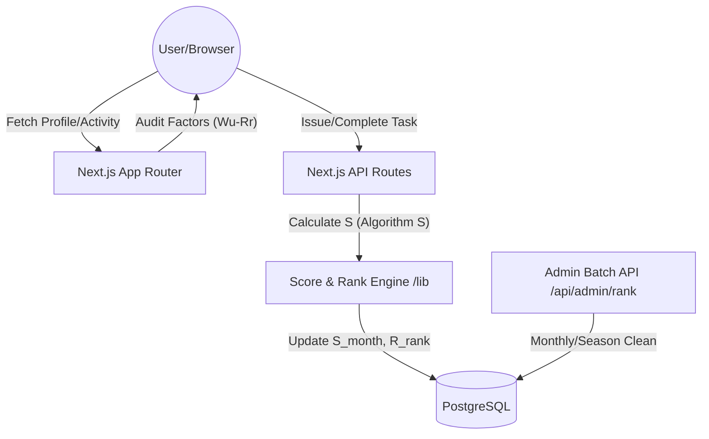

# Integrated Specification: Algorithm S + Rank System

## System Architecture


## Database Schema (Prisma)
```prisma
generator client {
  provider = "prisma-client-js"
}

datasource db {
  provider = "postgresql"
  url      = env("DATABASE_URL")
}

model User {
  id                String    @id @default(uuid())
  anonymousName     String    @unique
  role              String    @default("PLAYER")
  
  // Competitive Rank (A-Z)
  rank              String    @default("Z") // Latest spec: Starts from Z
  monthlyScore      Float     @default(0.0) // S_month
  totalScore        Float     @default(0.0) // Lifetime accumulation
  lastMonthScore    Float     @default(0.0) // For promotion/demotion checking
  graceMonths       Int       @default(0)   // For soft demotion (2 months consecutive)
  skillLevel        Float     @default(1.0) // EMA-based Sf
  
  balanceFlow       Float     @default(1000)
  balanceStock      Float     @default(0)
  
  // Relationships
  tasksRequested    Task[]    @relation("RequestedBy")
  tasksAssigned     Task[]    @relation("AssignedTo")
  transactionsSent  Transaction[] @relation("FromUser")
  transactionsRecv  Transaction[] @relation("ToUser")
  rankHistory       RankHistory[]
  createdAt         DateTime  @default(now())
}

model Task {
  id                String    @id @default(uuid())
  title             String
  description       String
  status            String    @default("OPEN")
  
  // Factors for D_f (Difficulty)
  baseReward        Float
  expectedHours     Float
  outputs           Int       @default(1)
  branches          Int       @default(0)
  skillCount        Int       @default(1)
  externalCount     Int       @default(0)
  requiredSkill     Float     @default(1.0)
  
  position          String    @default("GENERAL")
  tags              String    @default("[]")
  
  requesterId       String
  requester         User      @relation("RequestedBy", fields: [requesterId], references: [id])
  assigneeId        String?
  assignee          User?     @relation("AssignedTo", fields: [assigneeId], references: [id])
  transaction       Transaction?
  createdAt         DateTime  @default(now())
  updatedAt         DateTime  @updatedAt
}

model Transaction {
  id                String    @id @default(uuid())
  taskId            String?   @unique
  task              Task?     @relation(fields: [taskId], references: [id])
  fromUserId        String
  fromUser          User      @relation("FromUser", fields: [fromUserId], references: [id])
  toUserId          String
  toUser            User      @relation("ToUser", fields: [toUserId], references: [id])
  
  amount            Float     // C (Base Coin)
  finalScore        Float     // S (Complete Score)

  // Audit Logs for Algorithm S (Final Integrated Spec)
  wu                Float     // Uniqueness
  wd                Float     // Distribution
  pc                Float     // Position
  q                 Float     // Quality
  ac                Float     // Anti-collusion
  aa                Float     // Activity
  df                Float     // Difficulty
  sf                Float     // Skill
  eb                Float     // Efficiency
  rr                Float     // R_rank (Rank Correction - New)
  
  timestamp         DateTime  @default(now())
}

model RankHistory {
  id                String    @id @default(uuid())
  userId            String
  user              User      @relation(fields: [userId], references: [id])
  seasonId          String
  rank              String
  score             Float
  createdAt         DateTime  @default(now())
}
```
